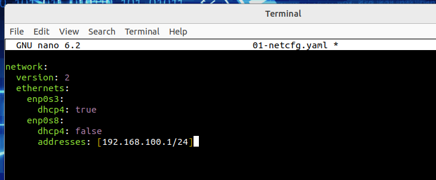
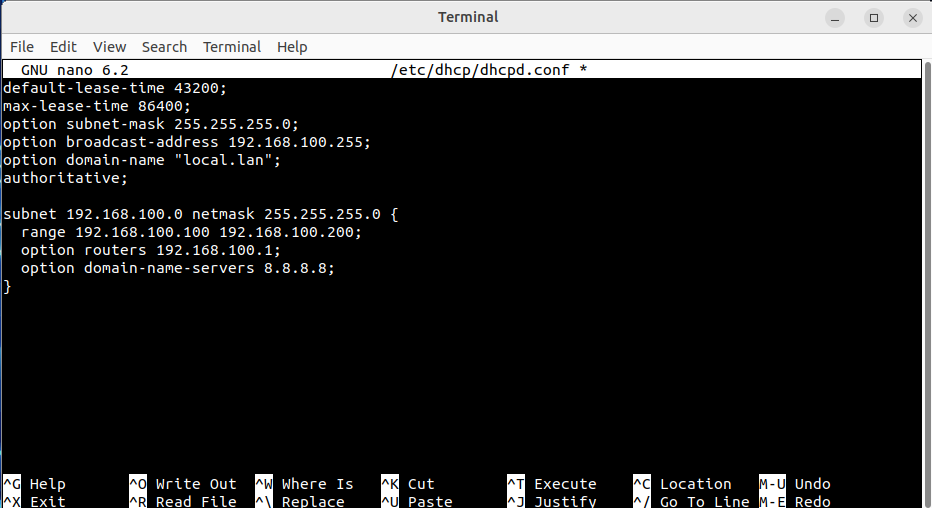
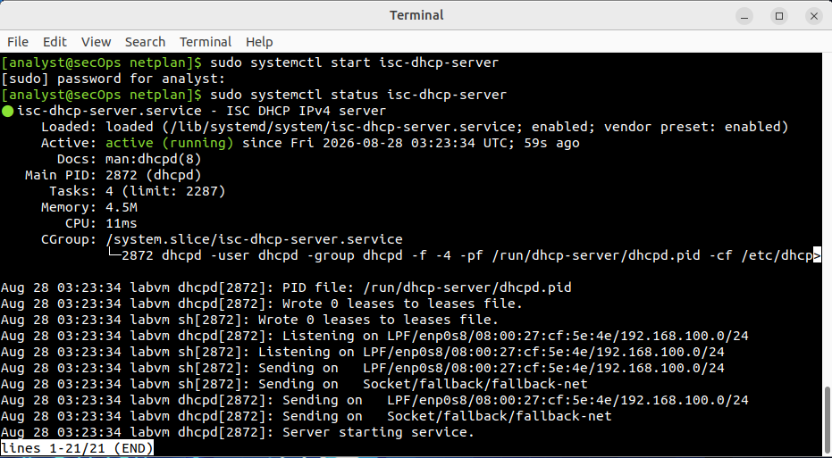
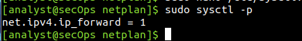
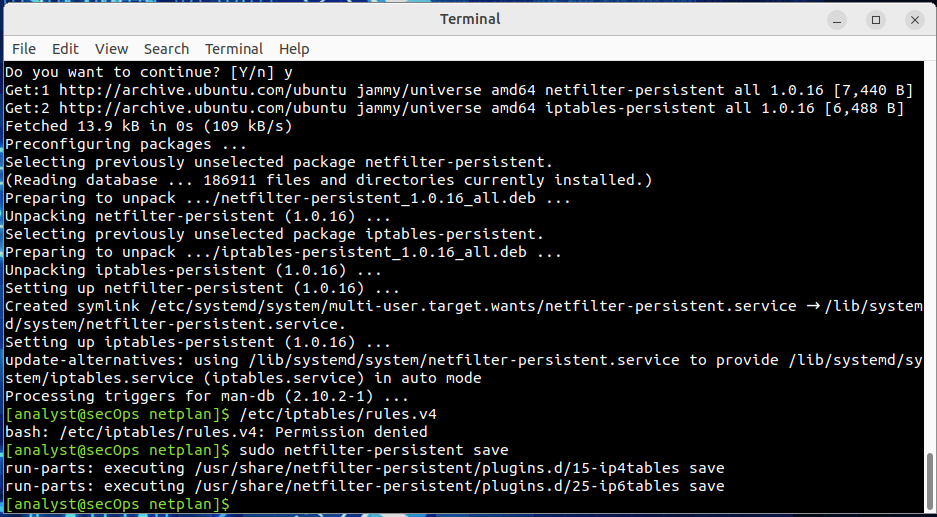
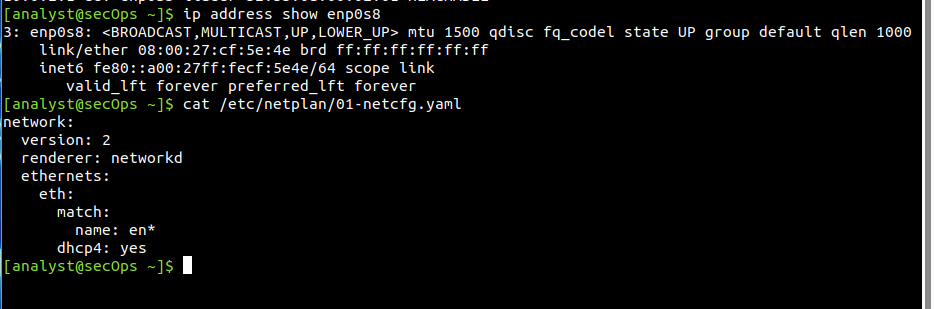
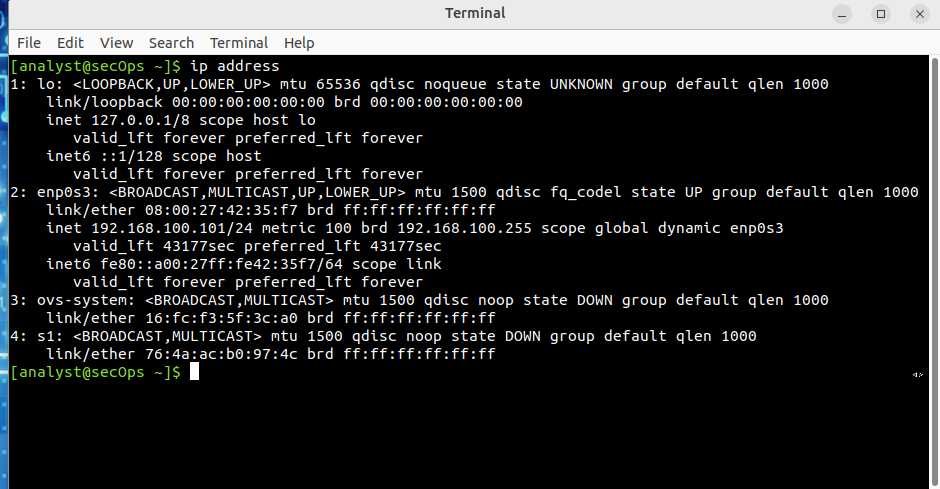
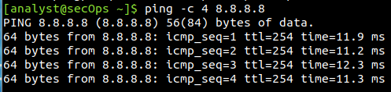
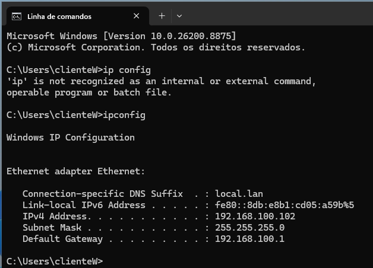
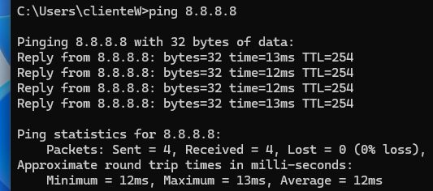

# Linux DHCP Server and Router

> Lab: DHCP-Router

In this lab I configured an Ubuntu Server to work as a DHCP server and router.

The server had two network interfaces. One interface was connected to the external network and the second one was connected to an internal network called `DHCP-LAN`.

I configured the DHCP service, enabled IP forwarding and created a NAT rule so that the clients on the internal network could access the external network through the Ubuntu Server.

## Project Flow

`External Network` → `Ubuntu Server` → `DHCP + Routing + NAT` → `DHCP-LAN` → `Ubuntu and Windows Clients`

## Tools Used

`Ubuntu Server` `Ubuntu Linux` `Windows` `VirtualBox` `Netplan` `ISC DHCP Server` `iptables` `iptables-persistent` `NAT`

## Network Configuration

I started by adding a second network interface to the Ubuntu Server.

After starting the VM, I used:

    ip address

to identify the network interfaces.

The server had:

| Interface | Configuration |
|---|---|
| `enp0s3` | DHCP |
| `enp0s8` | Static IP |

The `enp0s3` interface had:

    10.0.2.3/24

I configured the `enp0s8` interface with:

    192.168.100.1/24

I opened the Netplan configuration:

    sudo nano /etc/netplan/01-netcfg.yaml

and configured the two interfaces:

    network:
      version: 2
      ethernets:
        enp0s3:
          dhcp4: true
        enp0s8:
          dhcp4: false
          addresses: [192.168.100.1/24]

I saved the configuration and applied it with:

    sudo netplan apply

After that, I used `ip address` again to confirm the network configuration.

---

## DHCP Server Configuration

I installed the DHCP server with:

    sudo apt install isc-dhcp-server

After the installation, I checked its status:

    sudo systemctl status isc-dhcp-server

At this point the service showed:

    Active: failed

because the DHCP server still needed to be configured.

Before changing the configuration, I renamed the original file:

    sudo mv /etc/dhcp/dhcpd.conf /etc/dhcp/dhcpd.conf.origin

Then I created a new configuration file:

    sudo nano /etc/dhcp/dhcpd.conf

I configured the DHCP server with:

    default-lease-time 43200;
    max-lease-time 86400;
    option subnet-mask 255.255.255.0;
    option broadcast-address 192.168.100.255;
    option domain-name "local.lan";
    authoritative;

    subnet 192.168.100.0 netmask 255.255.255.0 {
      range 192.168.100.100 192.168.100.200;
      option routers 192.168.100.1;
      option domain-name-servers 8.8.8.8;
    }

The DHCP network was:

    192.168.100.0/24

The clients could receive addresses between:

    192.168.100.100

and:

    192.168.100.200

The gateway was:

    192.168.100.1

and the DNS server was:

    8.8.8.8

---

## DHCP Interface

I then configured the interface that would be used to assign IP addresses to the clients.

I opened:

    sudo nano /etc/default/isc-dhcp-server

and changed:

    INTERFACESv4=""

to:

    INTERFACESv4="enp0s8"

The `enp0s8` interface was connected to the internal `DHCP-LAN` network.

I then started the DHCP server:

    sudo systemctl start isc-dhcp-server

and checked its status:

    sudo systemctl status isc-dhcp-server

The service now showed:

    Active: active (running)

confirming that the DHCP server was working.

---

## Enabling Linux Routing

The next step was to configure the Ubuntu Server to work as a router between the internal and external networks.

I opened:

    sudo nano /etc/sysctl.conf

and enabled:

    net.ipv4.ip_forward=1

I then applied the configuration with:

    sudo sysctl -p

The result showed:

    net.ipv4.ip_forward = 1

confirming that IP forwarding was enabled.

---

## NAT Configuration

I then created a NAT rule to translate the private IP addresses from the `192.168.100.0/24` network when they left through the external `enp0s3` interface.

I used:

    sudo iptables -t nat -A POSTROUTING -o enp0s3 -j MASQUERADE

To keep the firewall rules after restarting the system, I installed:

    sudo apt-get install iptables-persistent

After the installation, I saved the rules with:

    sudo netfilter-persistent save

I then rebooted the server:

    sudo reboot

---

## Troubleshooting

After rebooting the server, I started testing the Ubuntu client.

The client received an IP address from the DHCP server and the gateway was configured as:

    192.168.100.1

I checked the routing information with:

    ip route

I then tested communication with the server/gateway:

    ping 192.168.100.1

The test failed.

I also used:

    ip neigh

to check if the client could find the MAC address of the gateway.

This also failed.

I returned to the Ubuntu Server and checked the `enp0s8` interface:

    ip address show enp0s8

I also checked the Netplan configuration:

    cat /etc/netplan/01-netcfg.yaml

I found that after the reboot the network configuration had been overwritten.

The VM used for the course contained a script that automatically restored the network configuration.

I removed the script from the Ubuntu Server and repeated the network configuration.

After configuring the server again, I returned to the Ubuntu client and repeated the tests.

---

## Ubuntu Client Validation

The Ubuntu client was connected to the internal `DHCP-LAN` network.

I used:

    ip address

to confirm that the client was receiving an IP address automatically from the DHCP server.

The Ubuntu client received:

    192.168.100.101/24

which was inside the configured DHCP range.

I then tested communication with the server/gateway:

    ping -c 4 192.168.100.1

The test was successful.

I tested external connectivity with:

    ping -c 4 8.8.8.8

This test was also successful.

Finally, I tested DNS resolution with:

    ping -c 4 google.com

This was also successful.

---

## Windows Client Validation

I then connected the Windows client to the same `DHCP-LAN` network.

After starting the VM, I opened Command Prompt and used:

    ipconfig

to confirm the network configuration received by the client.

The Windows client received:

    IPv4 Address: 192.168.100.102
    Subnet Mask: 255.255.255.0
    Default Gateway: 192.168.100.1

I then tested communication with the server/gateway:

    ping 192.168.100.1

The test was successful.

I tested external connectivity with:

    ping 8.8.8.8

This test was also successful.

Finally, I tested DNS resolution with:

    ping google.com

The DNS test was also successful.

All the tests were completed successfully, confirming that the objective of the lab was achieved.

## Key Findings

| Test | Result |
|---|---|
| Internal network | **192.168.100.0/24** |
| Internal server interface | **192.168.100.1/24** |
| DHCP range | **192.168.100.100 - 192.168.100.200** |
| Ubuntu client | **192.168.100.101/24** |
| Windows client | **192.168.100.102** |
| Default gateway | **192.168.100.1** |
| DNS server | **8.8.8.8** |
| DHCP interface | **enp0s8** |
| DHCP service | **Active and running** |
| IPv4 forwarding | **Enabled** |
| NAT | **Configured with iptables** |
| Ubuntu client tests | **Successful** |
| Windows client tests | **Successful** |
| External connectivity | **Successful** |
| DNS resolution | **Successful** |

## What I Learned

In this lab I learned how to configure an Ubuntu Server as a DHCP server and router.

I configured two network interfaces and used Netplan to give the internal interface the address `192.168.100.1/24`.

I configured the DHCP server to automatically assign IP addresses to the clients and defined the gateway and DNS server.

I also enabled IP forwarding and configured NAT so that the clients on the internal network could access the external network.

During the tests I found a problem after rebooting the server because the network configuration had been overwritten. I checked the network interface and the Netplan configuration, found the cause of the problem and configured the network again.

Finally, I tested the network using both Ubuntu and Windows clients and confirmed communication with the gateway, external connectivity and DNS resolution.
