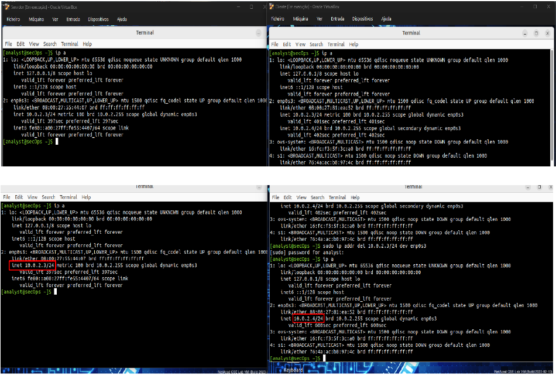
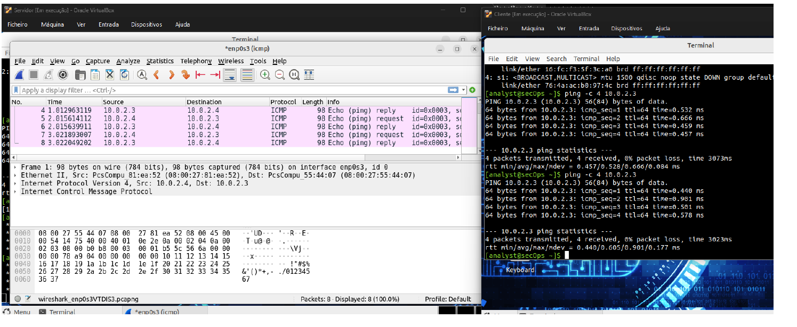
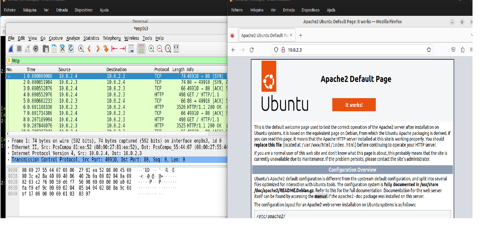
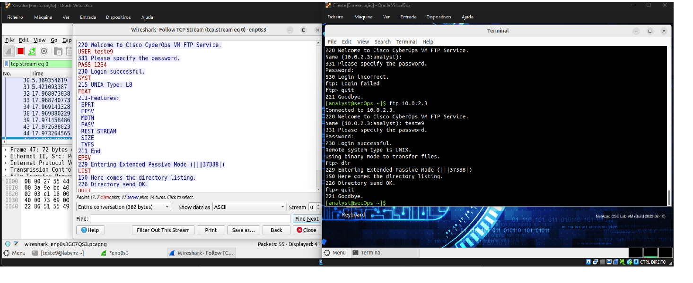
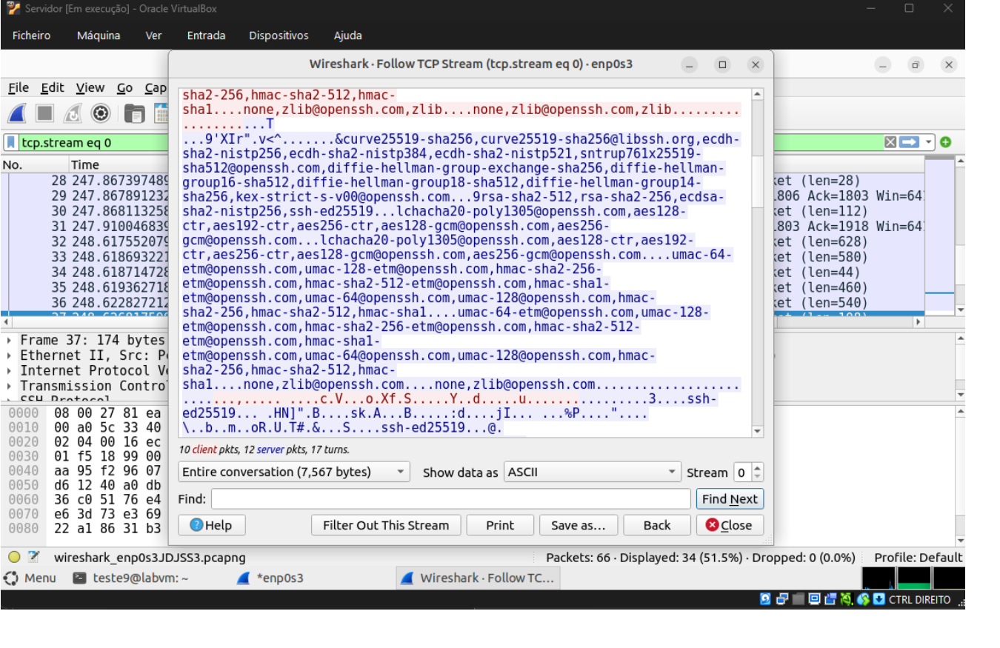

# Network Traffic Analysis with Wireshark

> IEFP — Técnico/a Especialista em Cibersegurança  
> UC 1490: Network Traffic Analysis with Wireshark

In this project, I created two Linux virtual machines, one as a client and the other as a server, and used Wireshark to analyze the traffic between them.

I tested ICMP, HTTP, FTP and SSH. With FTP I was able to see the login information and commands in the captured traffic. When I repeated a similar test with SSH, the traffic was encrypted and the contents could not be read.

## Analysis Flow

`Client / Server Setup` → `ICMP` → `HTTP` → `FTP` → `SSH`

## Tools Used

`Wireshark` `Linux` `VirtualBox` `Apache` `vsftpd` `OpenSSH`

## Environment Setup

I created two Linux virtual machines, one for the client and another for the server. Both were on the same network and had different MAC addresses.

When I checked the IP addresses with ip a, both machines were using 10.0.2.3.

I decided to renew the IP configuration on the client. I released its DHCP lease, cleared the addresses from the interface and then requested a new IP:

    sudo dhclient -r enp0s3
    sudo ip addr flush dev enp0s3
    sudo dhclient enp0s3

After running ip a again, the server was still using 10.0.2.3 and the client was now using 10.0.2.4.

On the server I installed the services needed for the tests:

- Apache for HTTP
- vsftpd for FTP
- OpenSSH Server for SSH

---

## ICMP Traffic

I opened Wireshark on the server and filtered only ICMP traffic.

Then, from the client, I pinged the server.

In Wireshark I could see the Echo Requests going from the client to the server and the Echo Replies coming back.

This also confirmed that the two machines could communicate.

---

## HTTP Traffic

For the HTTP test, I accessed the Apache server from the client using:

    http://10.0.2.3/

At the same time, Wireshark was capturing HTTP traffic on the server.

In the capture I could see the communication between both IP addresses and the TCP handshake.

---

## FTP Traffic

For the FTP test, I connected from the client to the FTP server while Wireshark was capturing the traffic.

After logging in, I went back to Wireshark and used Follow FTP Stream.

In the stream I could see the username and password entered from the client, as well as the FTP commands that were used during the session.

This showed that the FTP session was being sent in readable text.

---

## SSH Traffic

I then did a similar test using SSH.

From the client, I connected to the server, logged in, ran ls -l and then exited the session.

After that, I went back to Wireshark and followed the stream.

This time the contents were encrypted and unreadable. Unlike FTP, I could not see the password or the commands from the SSH session.

## FTP vs SSH

| Protocol | What I could see in Wireshark |
|---|---|
| **FTP** | Username, password and FTP commands were readable |
| **SSH** | Session contents were encrypted and unreadable |

The difference was easy to see in Wireshark. FTP showed the information in readable text, while SSH protected the contents of the session.

## Key Findings

| Test | Result |
|---|---|
| Environment | **Two Linux VMs, client and server** |
| Initial IPs | **Both machines were using 10.0.2.3** |
| After correction | **Server 10.0.2.3 / Client 10.0.2.4** |
| ICMP | **Echo Requests and Replies visible** |
| HTTP | **TCP handshake visible** |
| FTP | **Credentials and commands readable** |
| SSH | **Session contents encrypted** |
| Web server | **Apache** |
| FTP server | **vsftpd** |
| SSH server | **OpenSSH** |
| Main tool | **Wireshark** |

## What I Learned

This project gave me a practical view of what different protocols look like in Wireshark.

I first had to correct the IP configuration because both machines were using the same address. After that, I captured ICMP and HTTP traffic and could see the communication between the client and server.

The FTP and SSH tests were the most useful comparison. In FTP I could read the login information and commands directly from the stream. With SSH, I could still see the traffic, but the contents were encrypted.

This made it easier to understand the difference between plaintext and encrypted communication.
