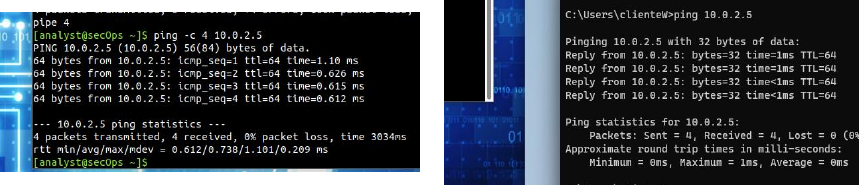
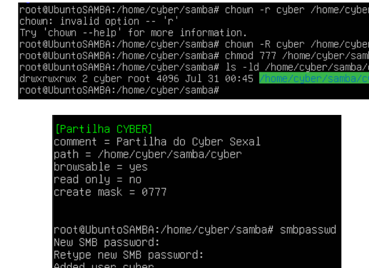
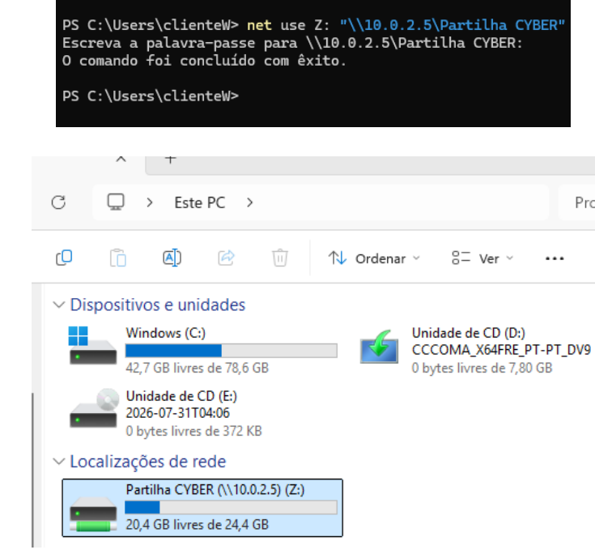
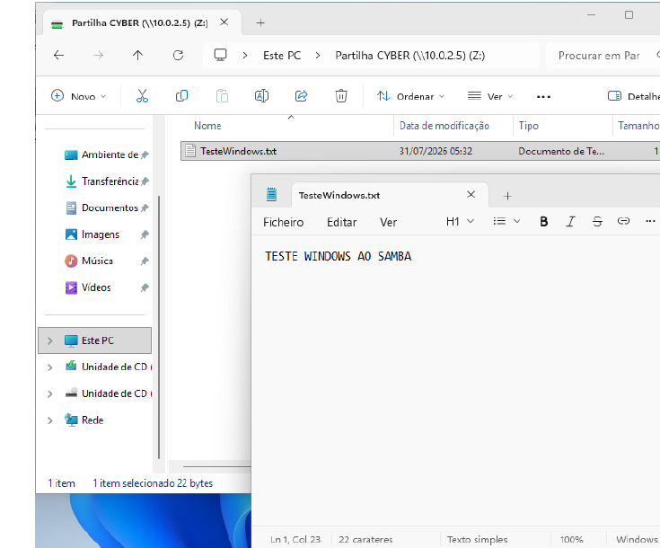
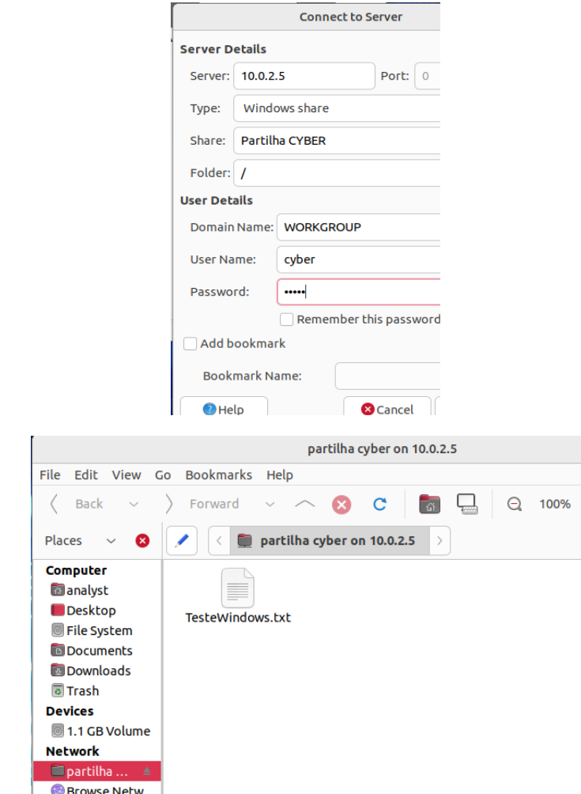
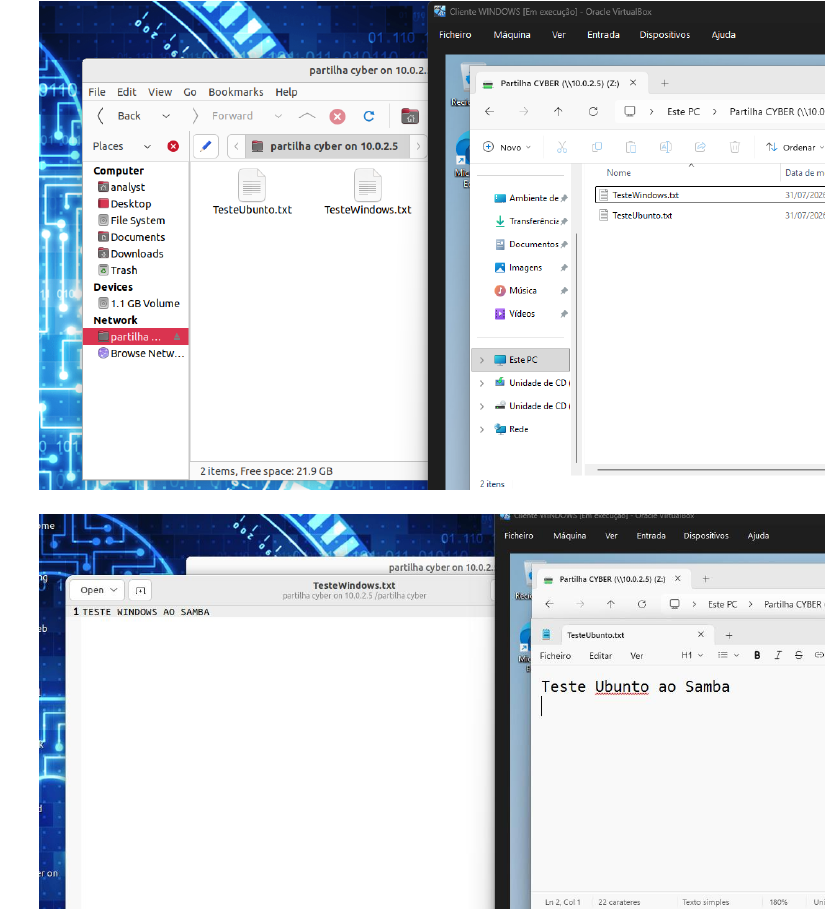

# Samba File Server

> IEFP — Técnico/a Especialista em Cibersegurança  
> UC 1490: Samba File Sharing

In this project, I configured an Ubuntu Server as a Samba file server.

I then connected to the shared folder from a Windows 11 client and an Ubuntu client to confirm that both machines could read and write files in the same share.

## Project Flow

`Network Setup` → `Samba Installation` → `Shared Folder` → `Windows Client` → `Ubuntu Client` → `Final Test`

## Tools Used

`Ubuntu Server` `Ubuntu` `Windows 11` `Samba` `VirtualBox` `PowerShell`

## Network Setup

I already had a Windows 11 VM and an Ubuntu client VM, so I created another VM with Ubuntu Server.

I connected all three virtual machines to the same NAT Network in VirtualBox.

The Ubuntu Server was using:

    10.0.2.5

Before continuing with Samba, I tested the connection from both clients by pinging the server.

Both clients were able to reach the server, so I continued with the Samba configuration.

---

## Samba Installation

On the Ubuntu Server, I switched to root and installed Samba:

    sudo su
    apt-get install samba

I then created a user called `cyber`:

    adduser cyber

Inside the user's home directory, I created the folders that I was going to use for the share:

    cd /home/cyber
    mkdir samba
    cd samba
    mkdir cyber

I used `pwd` and `ls` to check that the folder had been created in the correct location.

---

## Shared Folder Configuration

I changed the owner of the shared folder to the `cyber` user:

    chown -R cyber /home/cyber/samba/cyber

I initially typed the option incorrectly as `-r`, which returned an error, and then corrected it to `-R`.

For this lab, I gave the folder read, write and execute permissions with:

    chmod 777 /home/cyber/samba/cyber

I checked the permissions using:

    ls -ld /home/cyber/samba/cyber

After that, I opened the Samba configuration file:

    nano /etc/samba/smb.conf

I added a share called:

    [Partilha CYBER]

The share pointed to:

    /home/cyber/samba/cyber

I configured it to be browsable and writable.

I then added the `cyber` user to Samba:

    smbpasswd -a cyber

Finally, I restarted Samba and checked the service:

    service smbd restart
    service smbd status

> **Security note:** `chmod 777` was used for this lab. In a real environment I would use more restrictive permissions and only give access to the users or groups that need it.

---

## Windows 11 Client

On the Windows client, I opened PowerShell and connected the Samba share as drive `Z:`:

    net use Z: "\\10.0.2.5\Partilha CYBER" /user:cyber *

After entering the Samba password, the command completed successfully and the share appeared in Windows as network drive `Z:`.

To test writing to the share, I created:

    TesteWindows.txt

I wrote a test message in the file and saved it.

This confirmed that the Windows client could write to the shared folder.

---

## Ubuntu Client

I then moved to the Ubuntu client.

From the file manager, I selected **Connect to Server** and used:

- Server: `10.0.2.5`
- Type: `Windows share`
- Share: `Partilha CYBER`
- User: `cyber`

After connecting, I could already see `TesteWindows.txt`, which had been created from the Windows client.

I then created another file from Ubuntu:

    TesteUbuntu.txt

This gave me one file created from Windows and another created from Ubuntu in the same Samba share.

---

## Final Test

For the final test, I checked the shared folder from both clients.

The folder contained:

    TesteWindows.txt
    TesteUbuntu.txt

Both files were visible from Windows and Ubuntu, and I could also open their contents from both clients.

The share was therefore working correctly from both operating systems.

## Key Findings

| Test | Result |
|---|---|
| Server | **Ubuntu Server** |
| Server IP | **10.0.2.5** |
| File sharing service | **Samba** |
| Samba user | **cyber** |
| Shared folder | **/home/cyber/samba/cyber** |
| Share name | **Partilha CYBER** |
| Windows connection | **Successful** |
| Ubuntu connection | **Successful** |
| Windows write test | **Successful** |
| Ubuntu write test | **Successful** |
| Files available on both clients | **Successful** |

## What I Learned

With this project I learned how to configure an Ubuntu Server to share files using Samba.

I created the user and shared folder, configured Samba and then connected to the same share from Windows and Ubuntu.

The final test was useful because I could create a file from one operating system and then see and open it from the other.

I also worked with Linux file permissions during the configuration. For the lab I used `chmod 777`, but I understand that in a real environment the permissions should be limited to the users or groups that actually need access.
